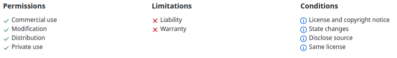
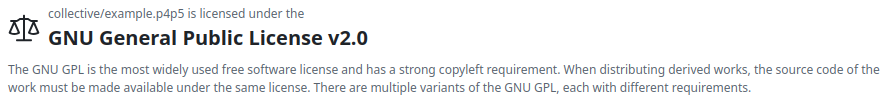
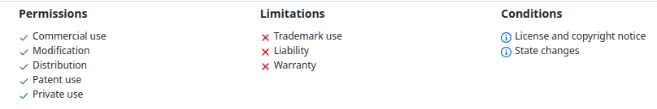
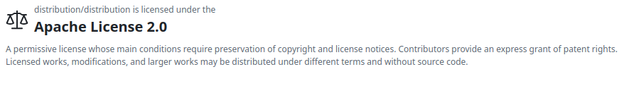
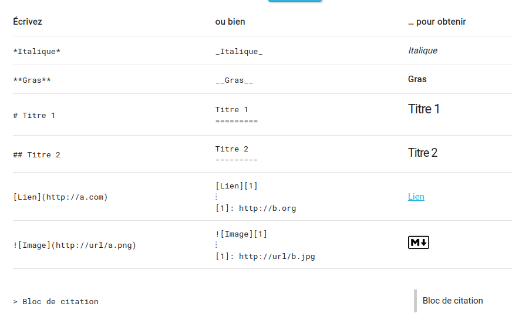
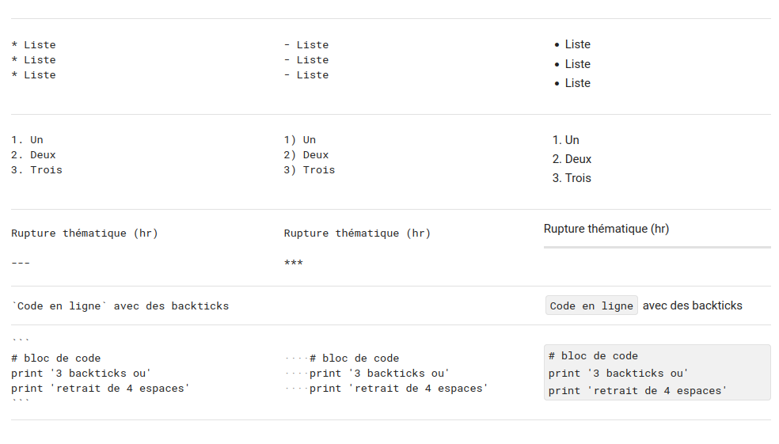

```{r setup, include=FALSE}
options(htmltools.dir.version = FALSE)
```
---


```{r, echo=FALSE, out.width="100%"}

```
---


```{r, echo=FALSE, out.width="100%"}

```

---

  
---

### whoami

```{r, echo=FALSE, out.width="60%"}

```
---


---


Voici une brève description des principaux fournisseurs Git ainsi que leurs caractéristiques distinctives, ces fournisseurs se distinguent principalement par leurs niveaux d'intégration dans les workflows DevOps, leurs outils de CI/CD, et leurs écosystèmes (par exemple, GitHub avec sa communauté open source, GitLab avec ses pipelines DevOps intégrés, ou Bitbucket avec l'intégration de Jira).
---


### 1. **GitHub**

```{r, echo=FALSE, out.width="40%"}
knitr::include_graphics("https://pngimg.com/uploads/github/github_PNG23.png")
```


   - **Description** : GitHub est l'une des plateformes Git les plus populaires, largement utilisée pour héberger des projets open source et collaboratifs.
   - **Caractéristiques** :
     - Intégration CI/CD via **GitHub Actions**.
     - Large communauté et collaboration facile.
     - Système de **pull requests** pour les revues de code.
     - Gestion des projets via des **issues**, **discussions**, et **projects**.
     - Interface utilisateur intuitive.
     - Hébergement gratuit pour les projets publics et offres premium pour les projets privés.

---


### 2. **GitLab**

```{r, echo=FALSE, out.width="50%"}
knitr::include_graphics("https://res.cloudinary.com/forest2/image/fetch/w_1300,f_auto/https://images.ctfassets.net/18a90cmjmaj9/5cg25LlXj7xzL6wLD7DbmW/e17b24e91db969662283e5a80ca5208c/cover.png")
```

   - **Description** : GitLab offre une plateforme complète de DevOps, intégrant non seulement le contrôle de version Git, mais aussi les pipelines CI/CD, la gestion de projets et la sécurité.
   - **Caractéristiques** :
     - **GitLab CI/CD** intégré et flexible.
     - Gestion complète du cycle de vie des logiciels.
     - Auto-hébergement disponible avec GitLab **Community Edition**.
     - Outils avancés pour la sécurité et la conformité (analyse de code statique, scans de vulnérabilité).
     - Interface pour la gestion des **merge requests** et des revues de code.

---


### 3. **Bitbucket**

```{r, echo=FALSE, out.width="50%"}
knitr::include_graphics("https://upload.wikimedia.org/wikipedia/commons/3/32/Atlassian_Bitbucket_Logo.png")
```   
   
   - **Description** : Bitbucket, propriété d'Atlassian, est conçu pour s'intégrer parfaitement avec d'autres outils Atlassian comme Jira et Trello.
   - **Caractéristiques** :
     - Intégration native avec **Jira** pour la gestion des projets agiles.
     - Pipelines CI/CD via **Bitbucket Pipelines**.
     - Prise en charge des dépôts **Mercurial** (jusqu'à son abandon en 2020).
     - Outils pour la gestion des branches et des permissions utilisateur.
     - Hébergement gratuit pour petits projets avec jusqu'à 5 utilisateurs pour des dépôts privés.
     - Options de déploiement auto-hébergé via **Bitbucket Server** (anciennement Stash).


---


### 4. **SourceForge**

```{r, echo=FALSE, out.width="50%"}
knitr::include_graphics("https://upload.wikimedia.org/wikipedia/commons/8/8f/SourceForge_logo_transparent.svg")
```   
   - **Description** : Historiquement une des premières plateformes de partage de projets open source, SourceForge offre des fonctionnalités Git bien qu'il soit moins populaire aujourd'hui.
   - **Caractéristiques** :
     - Fonctionnalités Git avec hébergement gratuit pour les projets open source.
     - Support de nombreux systèmes de versionnement, y compris Git et Subversion.
     - Outils de suivi de bugs, hébergement de fichiers, et gestion des versions.
     - Moins d’intégrations modernes que ses concurrents (CI/CD, etc.).


---


### 5. **Azure Repos (Azure DevOps)**


```{r, echo=FALSE, out.width="30%"}

```   


   - **Description** : Partie intégrante de la suite **Azure DevOps** de Microsoft, Azure Repos est utilisé pour le contrôle de version et les pipelines DevOps dans les environnements Microsoft.
   - **Caractéristiques** :
     - Intégration étroite avec **Azure Pipelines** pour CI/CD.
     - Support des dépôts **Git** et **TFVC** (Team Foundation Version Control).
     - Prise en charge des workflows Git standard (branches, pull requests).
     - Sécurité et permissions fines pour les dépôts privés.
     - Offre gratuite avec des fonctionnalités payantes pour des besoins avancés (tests, gestion des artefacts, etc.).

---


Il existe plusieurs façons d’installer Git sur Windows. Voici les méthodes les plus courantes, ainsi que des instructions détaillées pour chacune d'elles :

---


### 1. **Installation de Git via Git for Windows**

   **Étapes d'installation :**
   - Accédez au site officiel de [Git for Windows](https://gitforwindows.org/).  
   - Cliquez sur le bouton **Download** pour télécharger le programme d'installation.  
   - Une fois téléchargé, exécutez le fichier `.exe`.  
   - Suivez les instructions de l’assistant d’installation :  
     - **Composants** : Vous pouvez choisir des options comme l'intégration avec l'explorateur Windows ou les icônes de bureau.  
     - **Éditeur par défaut de Git** : Vous pouvez choisir un éditeur comme Vim ou un autre éditeur de texte (comme Notepad++ ou Visual Studio Code).  
     - **Variables d'environnement** : Il est recommandé de choisir l'option "Git from the command line and also from 3rd-party software", pour pouvoir utiliser Git aussi bien depuis Git Bash que le terminal Windows.  
     - **Configurer OpenSSL vs. Libcurl** : Laissez généralement l'option par défaut, OpenSSL.  
     - **Emulation Unix Git bash** : Vous pouvez choisir l'intégration avec Git Bash, CMD ou les deux.  


---

### 2. **Installation via Chocolatey (gestionnaire de paquets)**

### Étapes d'installation de Chocolatey :  

  - **Ouvrez PowerShell en tant qu'administrateur :**  
   - Appuyez sur les touches **Windows + X** et sélectionnez **Windows PowerShell (Admin)** ou **Terminal Windows (Admin)** selon la version de Windows.  
   - Si vous utilisez un environnement autre que PowerShell, vous pouvez aussi ouvrir **CMD** en mode administrateur, mais PowerShell est recommandé.  

  - **Vérifiez que la stratégie d'exécution permet l'exécution de scripts :**  
  
     ```powershell
     Set-ExecutionPolicy AllSigned
     ```
   - Si cela échoue, vous pouvez utiliser :  
     ```powershell
     Set-ExecutionPolicy Bypass -Scope Process
     ```  
---

  - **Installez Chocolatey :**
   - Une fois la politique d'exécution définie, exécutez cette commande pour télécharger et installer Chocolatey :  
   
     ```powershell
     Set-ExecutionPolicy Bypass -Scope Process -Force; [System.Net.ServicePointManager]::SecurityProtocol =    
     [System.Net.SecurityProtocolType]::Tls12; iex ((New-Object  
     System.Net.WebClient).DownloadString('https://community.chocolatey.org/install.ps1')  
     ```

  - **Vérifiez que Chocolatey est installé :**  
   - Tapez la commande suivante pour installer Git :  
     ```
     choco install git
     ```
---


### 3. **Installation via Scoop (gestionnaire de paquets)**
   **Scoop** est un autre gestionnaire de paquets pour Windows qui permet d’installer des applications via des commandes simples.  

   **Étapes d'installation :**  
   - Installez **Scoop** si vous ne l'avez pas encore, en exécutant cette commande dans PowerShell (en tant qu'administrateur) :  
     ```
     Set-ExecutionPolicy RemoteSigned -Scope CurrentUser
     iwr -useb get.scoop.sh | iex
     ```
     
   - Une fois **Scoop** installé, exécutez la commande suivante pour installer Git :
   
     ```
     scoop install git
     ```
   - Scoop téléchargera et installera automatiquement la version la plus récente de Git.  

---

### 4. **Installation via Winget (gestionnaire de paquets natif de Windows)**  
   Windows dispose de son propre gestionnaire de paquets appelé **Winget**. Cela vous permet de rechercher et d’installer des logiciels depuis la ligne de commande.  

   **Étapes d'installation :**  
   - Ouvrez un terminal PowerShell ou CMD.  
   - Pour installer Git, exécutez simplement la commande suivante :  
     ```
     winget install --id Git.Git -e --source winget
     ```
     
   - Suivez les instructions à l'écran pour compléter l'installation.  

---


### 5. **Installation via Visual Studio Installer**  

   Si vous avez déjà **Visual Studio** installé sur votre machine, vous pouvez installer Git en l’ajoutant via le programme d'installation de Visual Studio.  
   

   **Étapes d'installation :**  
   - Dans la fenêtre PowerShell, exécutez la commande suivante pour permettre l'exécution de scripts locaux non signés :
   - Ouvrez l’installateur de Visual Studio.  
   - Dans l’installateur, allez dans la section **Individual components** (Composants individuels).  
   - Cherchez et cochez l’option **Git for Windows**.  

---


### Vérification de l'installation de Git  
Une fois l'installation terminée avec l'une des méthodes ci-dessus, vous pouvez vérifier que Git est bien installé en ouvrant un terminal (Git Bash, CMD, ou PowerShell) et en exécutant la commande suivante :  

```
git --version
```
Cela affichera la version de Git installée sur votre machine.  

Ces méthodes couvrent la plupart des besoins pour installer et utiliser Git sur Windows. Chacune a ses avantages : **Git for Windows** est idéal pour les débutants, tandis que **Chocolatey**, **Scoop** et **Winget** sont parfaits pour les utilisateurs avancés qui souhaitent gérer plusieurs logiciels à partir de la ligne de commande.  


---


Un dépôt Git (ou **repository** en anglais) est une structure utilisée par Git pour stocker l'historique des versions d'un projet, que ce soit du code source, des fichiers texte, ou tout autre type de fichier. Il s'agit d'une collection de fichiers, de leur historique de modifications, ainsi que de métadonnées utilisées par Git pour suivre ces modifications.  

---


### Décomposition d'un dépôt Git :  

1. **Espace de travail (Working Directory)** : Il s'agit de la copie locale des fichiers du projet que vous modifiez directement sur votre machine.  

2. **Index (Staging Area)** : C'est une zone intermédiaire où sont placés les fichiers modifiés avant d'être enregistrés dans le dépôt. C'est ici que vous préparez vos modifications avant de les valider avec la commande `git commit`.  

3. **Historique des commits** : Chaque commit est un instantané des modifications du projet à un moment donné. Un commit contient des informations sur ce qui a changé, qui l'a modifié, et quand ces modifications ont été faites.  

4. **Branches** : Git permet de créer des branches pour travailler sur différentes versions du projet en parallèle. Par exemple, vous pouvez avoir une branche pour les nouvelles fonctionnalités, une autre pour la correction des bugs, etc.  

5. **Remotes** : Ce sont des dépôts distants (comme GitHub, GitLab ou Bitbucket), où vous pouvez synchroniser vos modifications avec d'autres utilisateurs. Un dépôt distant permet de collaborer avec d'autres développeurs en envoyant et en récupérant des modifications à partir d'un serveur.  

---


### Fonctionnalités clés d'un dépôt Git :  
- **Suivi des versions** : Git permet de suivre chaque changement apporté aux fichiers du projet, ce qui permet de revenir à des versions antérieures si nécessaire.  
- **Collaboration** : Plusieurs personnes peuvent travailler simultanément sur le même projet, en utilisant des branches pour isoler leurs travaux et fusionner ensuite les modifications.  
- **Gestion des conflits** : Lorsque plusieurs personnes modifient les mêmes fichiers, Git aide à résoudre les conflits potentiels de manière automatique ou manuelle.  

En résumé, un dépôt Git est l'endroit où vous stockez et gérez l'historique des versions d'un projet.  


---


## Choix du fournisseur de gestion de code GIT dans ce cours :  

  

---

La création d'un compte GitHub est simple et rapide. Voici les étapes pour créer un compte GitHub :

### 1. Accédez au site GitHub
- Ouvrez votre navigateur web et allez sur le site officiel de GitHub : [https://github.com](https://github.com).

### 2. Créez un compte
- Cliquez sur le bouton **Sign up** (S'inscrire) dans le coin supérieur droit de la page d'accueil.

### 3. Renseignez vos informations
- Vous serez redirigé vers une page de création de compte. Remplissez les champs demandés :
  - **Username** : Choisissez un nom d'utilisateur unique qui sera visible publiquement.
  - **Email address** : Entrez une adresse e-mail valide.
  - **Password** : Choisissez un mot de passe sécurisé.


---

### 4. Paramètres supplémentaires (facultatif)
- Vous pouvez être invité à répondre à des questions pour personnaliser votre expérience GitHub. Par exemple :
  - Voulez-vous recevoir des mises à jour de produits ?
  - Choisissez votre niveau d'expérience avec Git.

### 5. Vérification
- Il se peut que vous deviez résoudre un captcha pour vérifier que vous n'êtes pas un robot.
- GitHub peut également vous envoyer un e-mail de vérification. Ouvrez votre boîte mail et cliquez sur le lien de confirmation.

---


### 6. Choisir un plan
- GitHub propose un plan gratuit et plusieurs plans payants. Le plan gratuit est suffisant pour la majorité des projets, et vous permet de créer un nombre illimité de dépôts publics et privés.
  - Choisissez **Free** pour commencer avec le plan gratuit.

### 7. Finaliser l'inscription
- Une fois les étapes terminées, votre compte GitHub est créé et vous pouvez commencer à utiliser GitHub pour héberger des dépôts, collaborer sur des projets, et plus encore.

---

### 8. Configuration de Git (facultatif)
Si vous voulez commencer à utiliser Git en local avec votre compte GitHub, il est recommandé de configurer Git sur votre machine :
- Ouvrez votre terminal (ou invite de commande).
- Configurez votre nom d'utilisateur et votre email avec les commandes suivantes :

  ```bash
  git config --global user.name "VotreNomUtilisateur"
  git config --global user.email "VotreEmail"
  ```

### Voilà ! 🎉 Vous avez maintenant un compte GitHub, prêt à être utilisé pour vos projets.

---


### Choisir une licence sur GitHub :
GitHub propose plusieurs options pour la gestion des licences de vos projets, qui définissent comment les autres peuvent utiliser, modifier et distribuer votre code. Pour vous aider à choisir la licence adaptée à votre projet, GitHub propose un outil appelé **Choose a License** (Choisissez une licence), qui recommande des licences populaires selon le niveau d’ouverture que vous souhaitez.

---


Voici quelques-unes des licences open-source les plus courantes :

1. **MIT License** : C’est l’une des licences les plus permissives. Elle permet aux autres d’utiliser, copier, modifier et distribuer votre code, tant qu’ils incluent une copie de la licence originale.
   
2. **GNU General Public License (GPL)** : Cette licence oblige à rendre publique toute modification du code sous la même licence. Elle est souvent utilisée pour garantir que le logiciel reste libre et open-source.


---

3. **Apache License 2.0** : Similaire à la licence MIT, mais avec des clauses supplémentaires, notamment une protection contre les revendications de brevets.



4. **Creative Commons (CC)** : Utilisée principalement pour des contenus autres que du code, comme des documents, des images ou des tutoriels.  

---


### Comment ajouter une licence sur GitHub :  

1. Lorsque vous créez un nouveau dépôt sur GitHub, il vous est proposé d’ajouter une licence.  

2. Si vous avez déjà un dépôt sans licence, vous pouvez ajouter un fichier nommé `LICENSE` dans le répertoire racine du dépôt.  

3. Utilisez l’outil **Choose a License** de GitHub ([chooselicense.com](https://choosealicense.com)) pour vous aider à sélectionner la licence qui correspond le mieux à vos besoins.  

Il est important de comprendre que la licence que vous choisissez affectera la manière dont les autres peuvent interagir avec votre projet, et cela peut avoir des implications juridiques, donc choisissez avec soin.  

---


## La syntaxe de la documentation sur GitHub : le MarkDown  

https://www.arthurperret.fr/tutomd/  



---



Le **Markdown** est un langage de balisage léger qui permet de formater du texte de manière simple. Il est souvent utilisé pour la documentation, les README sur GitHub, ou les blogs. Voici une explication de la syntaxe Markdown la plus courante.  

---


### 1. **Titres (Headings)**  
Vous pouvez créer des titres en utilisant des `#`. Plus vous ajoutez de `#`, plus le niveau du titre est bas.

```  
# Titre de niveau 1  
## Titre de niveau 2  
### Titre de niveau 3  
#### Titre de niveau 4  
```


# Titre de niveau 1  
## Titre de niveau 2  
### Titre de niveau 3  
#### Titre de niveau 4  

---

### 2. **Texte en gras et en italique**  
- **Gras** : Utilisez deux astérisques `**` ou deux tirets bas `__`.  
- *Italique* : Utilisez un astérisque `*` ou un tiret bas `_`.  
- ***Gras et italique*** : Combinez les deux.  

**Texte en gras**  
*Texte en italique*  
***Texte en gras et italique***  
---

### 3. **Listes**  

#### Listes non ordonnées  

Utilisez des tirets `-`, des astérisques `*`, ou des plus `+` pour créer une liste à puces.  

- Élément 1  
- Élément 2  
  - Élément 2.1  
  - Élément 2.2  

#### Listes ordonnées
Utilisez des chiffres suivis d’un point.

1. Élément 1  
2. Élément 2  
   1. Sous-élément 2.1  
   2. Sous-élément 2.2  
---
  
### 4. **Liens et images**  

#### Liens  

Le texte du lien est placé entre crochets `[ ]`, suivi de l'URL entre parenthèses `( )`.  

[GitHub](https://github.com)  

#### Images  

Pour les images, ajoutez un point d’exclamation `!` avant le lien.  


---

### 5. **Blocs de code**  

Pour insérer un bloc de code, utilisez trois accents graves au début et à la fin, et précisez éventuellement le langage pour la coloration syntaxique.  


```python    
def bonjour():
    print("Bonjour le monde !")
```

### 6. **Citation**  

Utilisez le signe `>` pour créer une citation.  

> Ceci est une citation.  


---

### 7. **Tableaux**  

Les tableaux sont créés en utilisant des barres verticales `|` et des tirets `-` pour délimiter les colonnes.  


| Colonne 1 | Colonne 2 |
|-----------|-----------|
| Contenu 1 | Contenu 2 |

### 8. **Listes de tâches (Task lists)**  
Ajoutez des cases à cocher avec des crochets `[ ]` pour les tâches non complétées, et `[x]` pour celles complétées.  

- [x] Tâche 1 terminée  
- [ ] Tâche 2 non terminée  

---

### 9. **Liens vers sections**  

Si vous souhaitez lier une section d’un document à une autre, vous pouvez le faire en ajoutant un lien vers l’ancre. Par exemple, pour lier à un titre de section :  

[Aller à la section Titres](#titres-headings)  

Le Markdown est simple, mais très puissant pour formater du texte. Il est largement utilisé sur GitHub, les blogs, et bien d’autres plateformes.  

---

## Création d'un repository 

   - Connectez-vous à votre compte GitHub.  
   - Sur la page d'accueil, cliquez sur le bouton **"New"** à côté de la liste de vos dépôts (ou sur la page de votre profil).  
   - Ou bien, utilisez le lien direct : [Créer un nouveau dépôt](https://github.com/new).  

### 1. **Configurer le dépôt**  

   - **Nom du dépôt** : Entrez un nom pour votre dépôt. Ce nom doit être unique dans votre compte.  
   - **Description** (facultatif) : Ajoutez une courte description du dépôt.  
   - **Public/Private** : Choisissez si votre dépôt sera public (visible par tout le monde) ou privé (visible uniquement par vous et ceux à qui vous donnerez accès).  

---


### 2. **Initialisation du dépôt**
   - Vous pouvez cocher l'option **"Initialize this repository with a README"** si vous souhaitez ajouter un fichier README dès le départ.
   - Vous pouvez également ajouter un fichier `.gitignore` ou une licence si nécessaire.

### 3. **Finaliser la création**
   - Une fois les informations saisies, cliquez sur **"Create repository"** pour finaliser.

Votre dépôt GitHub est maintenant créé, et vous pouvez commencer à y ajouter des fichiers et des projets ! Si vous avez besoin d'aide pour pousser des fichiers vers votre dépôt, n'hésitez pas à demander.

---

Pour récupérer votre clé API GitHub (ou plutôt votre token d'accès personnel), suivez ces étapes :

1. **Connectez-vous à GitHub** : Accédez à [GitHub](https://github.com/) et connectez-vous à votre compte.

2. **Accédez aux paramètres de votre compte** : Cliquez sur votre photo de profil en haut à droite, puis sélectionnez **"Settings"** (Paramètres).

3. **Allez dans les paramètres des développeurs** : Dans le menu de gauche, cliquez sur **"Developer settings"** (Paramètres du développeur).

4. **Générez un nouveau token** : Sélectionnez **"Personal access tokens"** (Jetons d'accès personnel), puis cliquez sur **"Generate new token"** (Générer un nouveau jeton).

---

5. **Configurez votre token** :
   - Donnez un **nom** à votre token pour le reconnaître plus tard.
   - Sélectionnez les **scopes** ou permissions nécessaires pour votre token. Par exemple, pour un accès en lecture à vos dépôts, cochez "repo".
   - Vous pouvez également définir une **date d'expiration** pour le token.

6. **Générez le token** : Cliquez sur **"Generate token"** (Générer le jeton). 

7. **Copiez votre token** : Une fois le token généré, il sera affiché une seule fois. Assurez-vous de le copier et de le stocker en lieu sûr.

N'oubliez pas de garder ce token secret et de ne pas le partager, car il donne accès à votre compte GitHub selon les permissions que vous avez définies.

---


## Pousser un repertoire (push a repo)
Voici les étapes pour pousser un repository (repo) sur GitHub. Cela suppose que vous avez déjà installé Git sur votre machine et que vous avez un compte GitHub.

### 1. Cloner en local
```bash
git clone https://github.com/monuser/monrepo
```
### 2. Ajouter des fichiers et valider des changements
Faites les modifications souhaitées et faites un commit pour enregistrer les changements.

```bash
# Ajouter tous les fichiers dans le repo
git add .

# Faire un commit avec un message
git commit -m "Premier commit"
```

---


### 3. Pousser le repository local vers GitHub
Vous devez maintenant connecter votre repo local avec le repository GitHub.

```bash
# Ajouter le remote (remplacez l'URL par l'URL de votre repo GitHub)
git push https://monuser_apikey@github.com/monuser/monrepo
```


Note : Selon la configuration de votre repo, la branche par défaut peut être appelée `main` au lieu de `master`. Vous pouvez vérifier cela dans GitHub et ajuster la commande en conséquence.

### 4. Validation
Après avoir poussé, vous pourrez voir votre code sur GitHub en visitant votre repository en ligne.


---

## Schéma logique de fonctionnement d'un dépot :  

  

---

1. **Fork** : 
   - **Définition** : C'est une copie d'un dépôt de code source. Lorsque vous fork un projet, vous créez une version indépendante de ce dépôt sur votre propre compte ou espace. Cela vous permet de faire des modifications sans affecter l'original.
   - **Utilisation** : Généralement utilisé pour proposer des modifications à un projet sans avoir accès direct au dépôt principal. Vous pouvez développer des fonctionnalités ou corriger des bugs dans votre fork et soumettre des demandes de fusion pour que les modifications soient intégrées au dépôt principal.

2. **Push** :
   - **Définition** : Cette commande envoie les modifications locales de votre dépôt (ou branche) vers un dépôt distant (comme GitHub, GitLab, etc.).
   - **Utilisation** : Après avoir commis vos changements localement, vous utilisez `git push` pour les envoyer vers le dépôt distant afin que les autres puissent voir et récupérer vos modifications.

---

3. **Merge** :
   - **Définition** : C'est le processus d'intégration des changements d'une branche dans une autre. Cela peut se faire automatiquement si les changements ne sont pas en conflit, ou manuellement si des conflits doivent être résolus.
   - **Utilisation** : Par exemple, vous pouvez merger une branche de fonctionnalité dans la branche principale (`main` ou `master`) pour intégrer de nouvelles fonctionnalités ou corrections.

4. **Commit** :
   - **Définition** : C'est une opération qui enregistre les modifications dans l'historique du dépôt. Un commit est un instantané de votre projet à un moment donné.
   - **Utilisation** : Avant de pousser vos changements vers un dépôt distant, vous devez d'abord commettre ces changements localement pour les sauvegarder et les organiser.

---

5. **Pull** :
   - **Définition** : Cette commande récupère les dernières modifications du dépôt distant et les fusionne avec votre dépôt local.
   - **Utilisation** : Utilisé pour synchroniser votre copie locale du dépôt avec les modifications apportées par d'autres collaborateurs ou par vous-même à partir d'un autre endroit.

> Ces opérations sont essentielles pour gérer le code source et collaborer efficacement avec d'autres développeurs.


---


---


**GitHub Pages** est un service de GitHub qui permet d’héberger des sites web directement à partir d'un dépôt GitHub. Il est souvent utilisé pour créer des sites personnels, des blogs ou des pages de documentation pour des projets open-source. Ces sites sont servis via l'URL `username.github.io` ou `username.github.io/repository`, et peuvent être configurés pour utiliser des noms de domaine personnalisés.

Voici un aperçu de son fonctionnement et comment l'utiliser pour héberger votre site web.
---

## 1. **Fonctionnement de GitHub Pages**
GitHub Pages fonctionne en récupérant des fichiers statiques (HTML, CSS, JavaScript) directement à partir d’un dépôt GitHub public ou privé, puis en les publiant sous forme d’un site web. Les utilisateurs peuvent héberger des pages pour eux-mêmes, des organisations ou des projets spécifiques.

- **Sites utilisateur ou organisation** : Hébergés sous `username.github.io` (ou `organization.github.io`). Ce type de site utilise un dépôt spécifique nommé `username.github.io` ou `organization.github.io`.
- **Sites de projet** : Hébergés sous `username.github.io/nom-du-repository`. Chaque dépôt GitHub peut avoir une page GitHub dédiée à un projet spécifique.
---

## 2. **Créer un site GitHub Pages**
### Étape 1 : Créer un dépôt
Pour créer un site avec GitHub Pages, commencez par créer un dépôt sur GitHub. Voici les deux cas possibles :

- Pour un **site utilisateur ou organisation**, le dépôt doit obligatoirement être nommé `username.github.io`.
- Pour un **site de projet**, vous pouvez nommer le dépôt comme vous le souhaitez.


### Étape 2 : Ajouter des fichiers de site web
Une fois le dépôt créé, ajoutez les fichiers de votre site web (HTML, CSS, JavaScript).

Exemple de structure de fichiers :
```
index.html
style.css
script.js
```
---

### Étape 3 : Configurer GitHub Pages
1. **Accédez aux paramètres du dépôt** :
   - Dans le dépôt GitHub, allez dans l'onglet `Settings`.
   
2. **Activer GitHub Pages** :
   - Faites défiler la page jusqu'à la section **GitHub Pages**.
   - Sous "Source", vous pouvez choisir quelle branche et quel répertoire de votre dépôt sera utilisé pour héberger les fichiers du site. Par défaut, c’est la branche `main` ou `master` du dépôt, mais vous pouvez aussi spécifier un sous-répertoire comme `/docs`.

3. **Sélectionnez la branche** :
   - Choisissez la branche qui contient les fichiers HTML de votre site. Si vous avez une branche dédiée, comme `gh-pages`, sélectionnez-la.

4. **Enregistrer les modifications** :
   - Après avoir configuré la source, GitHub génère et héberge automatiquement le site.
---

### Étape 4 : Accéder à votre site
Une fois que GitHub Pages a terminé le déploiement de votre site (ce qui prend généralement quelques minutes), vous pouvez y accéder via l'URL `https://username.github.io` pour un site utilisateur ou `https://username.github.io/nom-du-repository` pour un site de projet.
---


## 1. **GitHub Student Developer Pack**
Le **GitHub Student Developer Pack** est une collection de logiciels et de services gratuits ou à prix réduit fournis par GitHub et ses partenaires, exclusivement pour les étudiants. Il inclut des offres pour des outils de développement, d'hébergement, d'analyse de code, d'apprentissage, et même des services de marketing ou de design.

---


### Principaux avantages du Pack :
- **Accès gratuit à GitHub Pro** : 
  - Avec GitHub Pro, les étudiants bénéficient de fonctionnalités avancées sur GitHub, telles que l’accès à des **dépôts privés illimités**, des **insights** pour leurs projets, et un **support avancé**.
  
- **Outils de développement gratuits** :
  - Des outils comme **JetBrains** (pour IntelliJ IDEA, PyCharm, etc.) qui offrent des licences d'accès à leur suite complète d'IDEs.
  - **Visual Studio Code** et des crédits Azure via **Microsoft Azure for Students** pour héberger des applications cloud.
---


- **Hébergement et services cloud** :
  - Des crédits gratuits chez des services cloud tels que **DigitalOcean**, **Heroku**, **AWS**, et **Google Cloud Platform**.
  - Hébergement de conteneurs et d'applications via **GitHub Actions** et des pipelines CI/CD intégrés.

- **Conception et développement web** :
  - Accès à des outils de création et de design tels que **Canva Pro** pour la création graphique.
  - **Bootstrap Studio** et **Figma** pour la conception de sites web et d’interfaces utilisateurs.

---


- **Outils d’apprentissage et de gestion de projet** :
  - Plateformes éducatives comme **Educative** (qui propose des cours interactifs) et **Datacamp** pour apprendre les compétences en science des données.
  - Outils de gestion de projet et de collaboration tels que **Trello** et **Notion** pour organiser et suivre les tâches.
  
- **Autres outils** : Par exemple, **Namecheap** offre des domaines gratuits pour l'hébergement de sites web.

---

### Exemples d'outils et services inclus :
- **DigitalOcean** : 100$ de crédits pour l'hébergement cloud.
- **Heroku** : Hébergement cloud gratuit avec fonctionnalités avancées.
- **JetBrains** : Accès gratuit aux outils JetBrains, tels que PyCharm, IntelliJ, WebStorm, etc.
- **Namecheap** : Un domaine gratuit `.me` et un certificat SSL.
- **AWS Educate** : Crédits pour l'utilisation d'AWS.
- **Bootstrap Studio** : Licence gratuite pour la création de sites web Bootstrap.
- **Microsoft Azure** : Accès gratuit à des services cloud avec Azure.
- **Figma** : Outil de conception d’interface collaborative.
- **Educative.io** : Cours interactifs gratuits sur des sujets technologiques.
- **Notion** : Outil de productivité gratuit pour les étudiants.

---

## 2. **Accès à GitHub Pro**
Le programme permet aux étudiants de bénéficier d’un abonnement gratuit à **GitHub Pro**. Les fonctionnalités incluent :
- **Dépôts privés illimités** : En tant qu'étudiant, vous pouvez créer autant de dépôts privés que vous le souhaitez pour travailler sur vos projets personnels ou universitaires.
- **Outils de gestion de projet avancés** : Suivez vos tâches, gérez des équipes, et obtenez des statistiques sur vos contributions grâce aux outils GitHub Pro.
- **Accès à GitHub Actions et Packages** : Utilisation de GitHub Actions pour automatiser vos workflows de CI/CD, et GitHub Packages pour héberger des packages privés.
---

## 3. **Ressources d'apprentissage et de développement**
Le GitHub Student Developer Pack est un excellent moyen de **développer des compétences** en utilisant des outils de développement et des environnements de production professionnels. Voici quelques ressources d'apprentissage intégrées dans le Pack :

- **Cours interactifs et certifications** : Grâce à des plateformes comme **Educative**, **Datacamp**, et **Codecademy**, les étudiants peuvent suivre des cours sur des sujets variés comme le développement web, les algorithmes, la science des données, etc.
- **Apprentissage du cloud** : Avec des crédits AWS, Google Cloud et Azure, les étudiants peuvent apprendre à déployer des applications cloud, configurer des services d'hébergement et acquérir des compétences recherchées dans le monde professionnel.
- **Participation à des communautés open-source** : Les étudiants peuvent contribuer à des projets open-source directement via GitHub, développer leur portfolio et leur visibilité dans la communauté de développeurs.
---

## 4. **Développement de portfolio professionnel**
Un autre avantage majeur du programme GitHub pour les étudiants est la possibilité de développer et d’héberger un **portfolio professionnel** avec GitHub Pages. Cela permet aux étudiants de :
- **Créer un site web personnel** pour montrer leurs projets.
- **Mettre en avant des contributions open-source**.
- **Partager des projets professionnels et académiques** avec des employeurs potentiels ou des mentors.
---

## 5. **Accès aux outils de collaboration et de gestion**
Pour les projets d’équipe, GitHub facilite la collaboration à travers des outils comme **GitHub Classroom** et **GitHub Projects**. Ces outils permettent aux étudiants de travailler sur des projets de groupe, de suivre des tâches, de gérer le versioning de code, et d'intégrer des workflows CI/CD.

### GitHub Classroom :
GitHub Classroom est particulièrement utile pour les enseignants et les étudiants dans le cadre de projets académiques. Il permet aux enseignants de créer des **devoirs basés sur des dépôts GitHub** et d'évaluer les projets des étudiants facilement.
---

## 6. **Éligibilité et inscription**
### Conditions d’éligibilité :
Pour bénéficier de ces avantages, les étudiants doivent répondre à certaines conditions :
- **Être inscrit dans un établissement d'enseignement** (université, école, etc.).
- Fournir un **e-mail académique** valide ou une preuve d'inscription (comme une carte d'étudiant).

### Comment s'inscrire :
1. Rendez-vous sur la page du **GitHub Student Developer Pack** : [https://education.github.com/pack](https://education.github.com/pack).
2. Cliquez sur "Get your Pack".
3. Vérifiez votre statut étudiant en fournissant une **adresse e-mail académique** ou une **preuve d'inscription** (une photo de votre carte d'étudiant par exemple).
4. Une fois validé, vous aurez accès aux outils et services inclus dans le Pack.

---


## 7. **Pourquoi utiliser GitHub Student Developer Pack ?**
Le GitHub Student Developer Pack est une excellente opportunité pour :
- **Acquérir des compétences techniques** en utilisant des outils professionnels.
- **Créer un portfolio solide** en ligne pour attirer l'attention des employeurs.
- **Travailler sur des projets réels** et se préparer au monde professionnel.
- **Collaborer** avec d’autres étudiants ou des contributeurs open-source.  

Ce pack offre une **valeur considérable** aux étudiants, en rendant accessibles des outils et services normalement payants, tout en les aidant à développer des compétences pratiques et à s’immerger dans le monde du développement logiciel.

---


Lorsque vous effectuez un **push** sur un dépôt GitHub, plusieurs scénarios peuvent survenir en fonction de l'état de votre dépôt local par rapport au dépôt distant. Voici les scénarios principaux, en fonction de si votre dépôt est **à jour**, **en avance** ou **en retard** par rapport au dépôt distant.


---

### 1. **Scénario 1 : Votre dépôt local est à jour avec le dépôt distant**
Dans ce cas, les branches locales et distantes sont synchronisées, c'est-à-dire qu'elles contiennent les mêmes commits. Le `push` se déroule alors sans problème, car il n'y a pas de divergence entre le dépôt local et le dépôt distant.

**Commande :**
```bash
git push origin <nom-branche>
```
---

### 2. **Scénario 2 : Votre dépôt local est en avance sur le dépôt distant**
Cela signifie que vous avez effectué des **commits** localement, mais que ces commits n'existent pas encore sur le dépôt distant. Dans ce cas, votre dépôt local a de nouvelles modifications que le dépôt distant n'a pas.

#### Cas où le dépôt distant n'a pas changé :
- **Résultat** : Le `push` est simple et fonctionne correctement. Vos nouveaux commits seront ajoutés au dépôt distant.

#### Cas où le dépôt distant a changé :
- **Problème potentiel** : Si des changements ont été apportés au dépôt distant, il est possible que Git refuse le `push`, car il y aurait un **conflit** entre les deux versions (locale et distante).
---

**Message d'erreur typique :**
```bash
! [rejected]        <nom-branche> -> <nom-branche> (non-fast-forward)
```

- **Solution** : Vous devrez d'abord **récupérer les modifications du dépôt distant** avant de pouvoir pousser vos propres changements.

**Commande :**
```bash
git pull --rebase origin <nom-branche>
# Résolvez les conflits s'il y en a
git push origin <nom-branche>
```
---

### 3. **Scénario 3 : Votre dépôt local est en retard par rapport au dépôt distant**
Votre dépôt local est "en retard" lorsqu'il manque des commits qui ont été ajoutés au dépôt distant par d'autres collaborateurs. Cela signifie que des modifications ont été faites sur le dépôt distant que vous n'avez pas encore récupérées.

#### Cas où vous n'avez pas encore de nouveaux commits localement :
- **Solution** : Vous pouvez simplement faire un `pull` pour récupérer les commits distants.

**Commande :**
```bash
git pull origin <nom-branche>
```
---

#### Cas où vous avez des commits locaux (en avance et en retard à la fois) :
- **Problème** : Vous ne pouvez pas effectuer de `push` tant que vous n'avez pas intégré les modifications distantes dans votre historique de commits local.

**Solution** : Faire un **pull avec rebase** pour intégrer les changements distants et placer vos commits locaux au-dessus.

**Commande :**
```bash  
git pull --rebase origin <nom-branche>
# Résolvez les conflits s'il y en a
git push origin <nom-branche>
```

---

### 4. **Scénario 4 : Conflits lors du pull**  

Lorsque vous tentez de faire un `git pull` (ou `git pull --rebase`), il peut y avoir des **conflits** si les mêmes fichiers ont été modifiés à la fois localement et sur le dépôt distant. Vous devrez résoudre ces conflits manuellement en choisissant quelles modifications garder.  

**Étapes pour résoudre un conflit :**  

1. Git marquera les fichiers en conflit.  

2. Ouvrez les fichiers pour voir les sections en conflit.  

3. Modifiez manuellement le fichier pour résoudre le conflit.  

4. Ajoutez les fichiers résolus (`git add`).  

5. Continuez le rebase ou le merge (`git rebase --continue` ou `git merge --continue`).  

6. Poussez ensuite vos modifications (`git push`).  


---

### 5. **Scénario 5 : Force Push**

Si vous avez réécrit l'historique des commits locaux, par exemple avec un **rebase** ou un **reset**, vous devrez utiliser un **force push** pour remplacer l'historique distant avec votre nouvel historique local.  

**Commande :**  

```bash
git push --force origin <nom-branche>
```

> **Attention** : Le `force push` peut être dangereux car il réécrit l'historique sur le dépôt distant, ce qui peut poser des problèmes aux autres collaborateurs.  

---

### Résumé :  

- **Dépôt local à jour** : Le `push` est simple et réussi.  

- **Dépôt local en avance** : Si le dépôt distant n'a pas changé, le `push` est direct. Sinon, un `pull` est nécessaire.  

- **Dépôt local en retard** : Il faut d'abord faire un `pull` pour récupérer les changements distants.  
- **Conflits** : Ils doivent être résolus manuellement avant de pouvoir pousser.  

- **Force Push** : Nécessaire si l'historique a été réécrit localement.  

Ces scénarios couvrent la plupart des situations que vous pouvez rencontrer lors d'un `git push` sur GitHub.  

> Si vous avez des questions plus spécifiques ou des scénarios en tête, n'hésitez pas à demander !  
