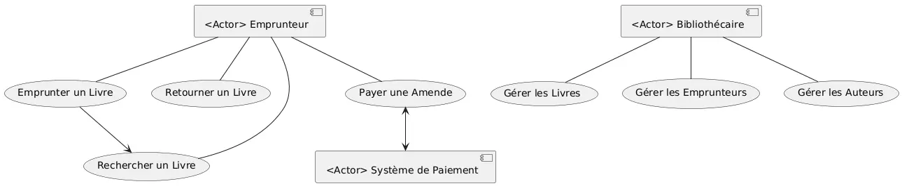
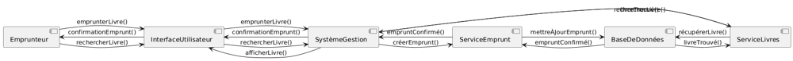
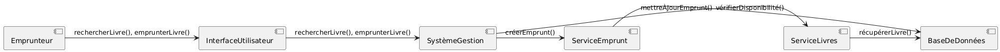

```{r, setup, include=FALSE}
library(nomnoml)
```

# Introduction à l'UML
  
**Comprendre le langage de modélisation unifié**
  
---

### Introduction  
  
**Qu'est-ce que l'UML ?**  
  
L'UML, ou Unified Modeling Language, est un langage de modélisation graphique destiné à visualiser, spécifier, construire et documenter les artefacts d'un système. Il est largement utilisé dans le développement logiciel pour représenter la structure et le comportement d'un système de manière standardisée.

**Importance dans le développement logiciel**  
  
L'UML joue un rôle crucial dans le développement de logiciels modernes en facilitant la communication entre les différentes parties prenantes, telles que les développeurs, les analystes et les clients. En fournissant des représentations visuelles, il aide à la compréhension des systèmes complexes et permet de clarifier les exigences fonctionnelles et non fonctionnelles.

---

### Historique  

**Origines de l'UML**  
  
L'UML a été développé dans les années 1990 par trois pionniers de l'ingénierie logicielle : Grady Booch, Ivar Jacobson et James Rumbaugh. Ce langage est le fruit de la fusion de plusieurs méthodes de modélisation orientée objet existantes.

**Évolution et standardisation**  
  
Le premier standard UML 1.0 a été publié en 1997 par l'Object Management Group (OMG). Depuis lors, UML a évolué pour intégrer des améliorations, notamment avec l'introduction de UML 2.x, qui a élargi la notation et amélioré la sémantique, rendant le langage plus puissant et accessible.

---

### Objectifs de l'UML  
  
**Visualisation** 
  
L'un des principaux objectifs de l'UML est de permettre la création de représentations graphiques des systèmes. Ces visualisations rendent la structure et le comportement d'un système plus clairs et compréhensibles pour tous les intervenants.
  
**Spécification** 
  
UML fournit également un moyen précis de définir les composants d'un système et leurs interactions. Cela permet de s'assurer que toutes les parties prenantes ont une compréhension commune des exigences et des fonctionnalités.
  
**Documentation**  
  
Enfin, UML offre une documentation standardisée qui peut être utilisée tout au long du cycle de vie du développement. Cette documentation facilite la maintenance et l'évolution des systèmes logiciels.

---  

### Types de diagrammes UML  

**Présentation des 14 types de diagrammes**  

  UML comprend 14 types de diagrammes, divisés en deux catégories principales :  
  
- **Diagrammes structurels** :  
  
  - Diagramme de classes  
  
  - Diagramme d'objets  
  
  - Diagramme de composants  
  
  - Diagramme de déploiement  
  
---

- **Diagrammes comportementaux** :
  
  - Diagramme de cas d'utilisation
  
  - Diagramme de séquence
  
  - Diagramme de collaboration
  
  - Diagramme d'activités
  
  - Diagramme d'états
  
  - Diagramme de timing
  
  - Diagramme d'interaction
  
  Ces diagrammes offrent différentes perspectives sur le système et sont utilisés en fonction des besoins spécifiques du projet.  

---
  
### Diagrammes structurels  
  
### Description générale des diagrammes structurels  
  
Les diagrammes structurels jouent un rôle fondamental dans la modélisation d'un système en mettant l'accent sur sa structure statique. Contrairement aux diagrammes comportementaux qui se concentrent sur les interactions et les dynamiques, les diagrammes structurels se focalisent sur les composants et leurs relations à un moment donné.   
  
---
  
#### Principales caractéristiques des diagrammes structurels :
  
1. **Représentation des composants :** Ils permettent de visualiser les différents composants d'un système, tels que les classes, les objets, les modules, et comment ils s'assemblent.  
   
2. **Relations :** Les diagrammes montrent les relations entre les composants, comme l'héritage, l'association et la composition. Cela permet de comprendre comment les différentes parties d'un système sont interconnectées.  
   
3. **Statique vs. dynamique :** Ils fournissent une vue statique du système, en opposant les interactions qui peuvent se produire à un moment donné. Cela est essentiel pour la conception et l'analyse des systèmes.  
  
4. **Architecture du système :** Les diagrammes structurels aident à décrire l'architecture d'un système, en mettant en lumière la disposition physique des objets et leur organisation.  

---
  
### Types de diagrammes structurels  
  
Les diagrammes structurels comprennent principalement :  
  
  - **Diagrammes de classes :** Montrent les classes du système et leurs relations. 
  
  - **Diagrammes d'objets :** Illustrent des instances de classes à un moment donné.  
  
  - **Diagrammes de composants :** Représentent les composants logiciels et leurs interfaces.  
  
  - **Diagrammes de déploiement :** Dépeignent l'architecture physique d'un système, y compris le matériel et les logiciels.  
  
---

### Diagramme de Classes

#### Description du Diagramme
Dans cet exemple :

- **Classe "Personne"** : 
  - Attributs : `nom`, `âge`
  - Méthodes : `sePresenter()`
  
- **Classe "Étudiant"** (qui hérite de "Personne") :
  - Attributs : `numéroEtudiant`
  - Méthodes : `s'inscrire()`
  
- **Relation d'héritage** : L'étudiant est une spécialisation de la classe Personne, ce qui signifie qu'il hérite des attributs et méthodes de la classe Personne.


---

### Exemple de Diagramme de Classes

Imaginons un système de gestion de bibliothèque avec les classes suivantes : **Livre**, **Auteur**, et **Emprunteur**.

#### Description des classes :

- **Classe "Livre"**
  - Attributs :
    - `titre: String`
    - `isbn: String`
    - `annéePublication: int`
  - Méthodes :
    - `emprunter(emprunteur: Emprunteur): void`
    - `retourner(): void`

---

  - **Classe "Auteur"**
  - Attributs :
    - `nom: String`
    - `dateNaissance: Date`
  - Méthodes :
    - `écrireLivre(titre: String): Livre`

- **Classe "Emprunteur"**
  - Attributs :
    - `nom: String`
    - `numéroEmprunteur: String`
  - Méthodes :
    - `demanderLivre(livre: Livre): void`
    - `retournerLivre(livre: Livre): void`
---

#### Relations :  

- Un **Livre** peut avoir un ou plusieurs **Auteurs**.
  
- Un **Emprunteur** peut emprunter plusieurs **Livres**.  


### Représentation en UML

```{nomnoml}

#direction: right
#font: 14px
#stroke: #333
#fill: #f9f9f9

[Livre|
  +titre: String
  +isbn: String
  +annéePublication: int
  +emprunter(emprunteur: Emprunteur): void
  +retourner(): void
]

[Auteur| 
  +nom: String
  +dateNaissance: Date
  +écrireLivre(titre: String): Livre
]

[Emprunteur| 
  +nom: String
  +numéroEmprunteur: String
  +demanderLivre(livre: Livre): void
  +retournerLivre(livre: Livre): void
]

[Livre] *-- [Auteur]
[Emprunteur] *-- [Livre]
```

---

### Explication de la syntaxe :  


- **[Livre| ...]** : Représentation de la classe Livre avec ses attributs et méthodes.  

- **[Auteur| ...]** : Représentation de la classe Auteur avec ses attributs et méthodes.  

- **[Emprunteur| ...]** : Représentation de la classe Emprunteur avec ses attributs et méthodes.  
  
- **[Livre] \*-- [Auteur]** : Indique qu'un Livre peut avoir plusieurs Auteurs (association).  
- **[Emprunteur] \*-- [Livre]** : Indique qu'un Emprunteur peut emprunter plusieurs Livres. 

---

Pour créer un diagramme d'objets à partir du diagramme de classes fourni, nous allons représenter des instances spécifiques des classes `Livre`, `Auteur`, et `Emprunteur`. Un diagramme d'objets montre des objets réels (instances de classes) avec leurs valeurs d'attributs actuelles et les liens entre eux.

Voici comment cela peut être traduit :

---  
   
### Exemple de Diagramme d'Objets  
  
#### Instances (Objets) :  

- **Livre** :  

  - Objet : `livre1` 
  
    - `titre: "Les Misérables"`  
    - `isbn: "978-2-07-040933-1"`  
    - `annéePublication: 1862`  
    
  - Objet : `livre2`  
  
    - `titre: "1984"`  
    - `isbn: "978-0-452-28423-4"`  
    - `annéePublication: 1949`  

---  
  
- **Auteur** :  
  
  - Objet : `auteur1`  
    - `nom: "Victor Hugo"`  
    - `dateNaissance: 1802-02-26`  
    
  - Objet : `auteur2`  
    - `nom: "George Orwell"`  
    - `dateNaissance: 1903-06-25`  

---

- **Emprunteur** :  
  - Objet : `emprunteur1`  
    - `nom: "Jean Dupont"`  
    - `numéroEmprunteur: "E1234"`  
  
  - Objet : `emprunteur2`  
    - `nom: "Marie Curie"`  
    - `numéroEmprunteur: "E5678"`  

---

#### Relations :  

- **`livre1`** est écrit par **`auteur1`**.  
  
- **`livre2`** est écrit par **`auteur2`**.  
  
- **`emprunteur1`** a emprunté **`livre1`**.  

- **`emprunteur2`** a emprunté **`livre2`**.  

---

#### Représentation du Diagramme d'Objets en UML :  
  
```{nomnoml}

#direction: center
#font: 14px
#stroke: #333
#fill: #f9f9f9

[livre1: Livre|
  titre = "Les Misérables"
  isbn = "978-2-07-040933-1"
  annéePublication = 1862
]

[livre2: Livre|
  titre = "1984"
  isbn = "978-0-452-28423-4"
  annéePublication = 1949
]

```
---

```{nomnoml}

#direction: center
#font: 14px


[auteur1: Auteur| 
  nom = "Victor Hugo"
  dateNaissance = 1802-02-26
]

[auteur2: Auteur| 
  nom = "George Orwell"
  dateNaissance = 1903-06-25
]
```

---

```{nomnoml}

#direction: center
#font: 14px


[emprunteur1: Emprunteur| 
  nom = "Jean Dupont"
  numéroEmprunteur = "E1234"
]

[emprunteur2: Emprunteur| 
  nom = "Marie Curie"
  numéroEmprunteur = "E5678"
]
```

---

```{nomnoml}

#direction: center
#font: 14px


[livre1] -- [auteur1]
[livre2] -- [auteur2]
[emprunteur1] -- [livre1]
[emprunteur2] -- [livre2]
```

---

Ce diagramme montre des objets particuliers (les instances `livre1`, `livre2`, etc.) avec leurs relations concrètes, tels que l'emprunt de livres par des emprunteurs et les liens entre auteurs et livres.

---

Pour créer le diagramme de composants correspondant, nous allons représenter les différents composants logiciels impliqués dans le système de gestion de bibliothèque et leurs interactions. Un diagramme de composants en UML décrit la structure physique d'un système, y compris les fichiers, bibliothèques ou services que le système utilise.

---
  
### Description des Composants :  
  
1. **Système de gestion de bibliothèque** : 
   - Principal composant qui orchestre les opérations du système.
  
2. **Composant "Base de Données"** :  

   - Gère les informations stockées, telles que les livres, les auteurs, et les emprunteurs.  

3. **Composant "Service Emprunt"** :  

   - Gestion des opérations liées à l'emprunt et au retour de livres.

---

4. **Composant "Service Livres"** :  

   - Gestion des informations relatives aux livres, telles que la recherche de livres, et les détails comme le titre et l'ISBN.  

5. **Composant "Service Auteurs"** :  

   - Gestion des informations relatives aux auteurs, y compris la création et la recherche d'auteurs.  

6. **Composant "Service Emprunteurs"** :  

   - Gestion des informations liées aux emprunteurs (enregistrement et gestion des emprunts).  

---
  
#### Représentation du Diagramme de Composants en UML :  

```{nomnoml}  

#direction: right
#font: 14px
[<abstract>Component SystèmeGestionBibliothèque|
  + gérerEmprunt()
  + gérerLivres()
  + gérerAuteurs()
  + gérerEmprunteurs()
]

[<abstract>Component ServiceEmprunt|
  + emprunterLivre()
  + retournerLivre()
]
```  

---  
  
```{nomnoml}  

[<abstract>Component ServiceLivres|
  + rechercherLivre()
  + ajouterLivre()
]

[<abstract>Component ServiceAuteurs|
  + rechercherAuteur()
  + ajouterAuteur()
]

[<abstract>Component ServiceEmprunteurs|
  + rechercherEmprunteur()
  + enregistrerEmprunteur()
]

[<abstract>Component BaseDeDonnées|
  + stockerDonnées()
  + récupérerDonnées()
]
```

---  

```{nomnoml}  
  
[SystèmeGestionBibliothèque] --> [ServiceEmprunt]
[SystèmeGestionBibliothèque] --> [ServiceLivres]
[SystèmeGestionBibliothèque] --> [ServiceAuteurs]
[SystèmeGestionBibliothèque] --> [ServiceEmprunteurs]

[ServiceEmprunt] --> [BaseDeDonnées]
[ServiceLivres] --> [BaseDeDonnées]
[ServiceAuteurs] --> [BaseDeDonnées]
[ServiceEmprunteurs] --> [BaseDeDonnées]

```

---  

### Explication du Diagramme :  
  
- **SystèmeGestionBibliothèque** : C'est le composant principal qui gère les différentes fonctionnalités de la bibliothèque.  

- **ServiceEmprunt** : Ce composant gère toutes les actions liées aux emprunts et aux retours de livres.  

- **ServiceLivres** : Il gère les informations sur les livres (ajout, recherche, etc.).  

- **ServiceAuteurs** : Il s'occupe des informations relatives aux auteurs.  

- **ServiceEmprunteurs** : Gère les données des emprunteurs, y compris leur enregistrement et la gestion des emprunts.  

- **BaseDeDonnées** : Le composant qui stocke et gère les données des livres, auteurs, et emprunteurs. Chaque service interagit avec la base de données pour récupérer ou stocker des informations.  

Ce diagramme montre comment les différents composants logiciels interagissent pour fournir les fonctionnalités nécessaires au système de gestion de bibliothèque.

---

Le diagramme de déploiement montre la manière dont les composants logiciels sont déployés sur l'infrastructure physique, c'est-à-dire sur des nœuds matériels comme des serveurs, des bases de données, ou encore des machines clientes. Cela inclut les relations entre les différents nœuds (physiques ou virtuels) et la manière dont les composants sont distribués.

---  
  
### Diagramme de Déploiement pour le Système de Gestion de Bibliothèque
  
#### Nœuds (Matériels et Logiciels) :  

1. **Serveur d'Application** :  
   - Héberge les services comme le **Service Emprunt**, **Service Livres**, **Service Auteurs**, et **Service Emprunteurs**.
  
2. **Serveur de Base de Données** :  
   - Héberge la **Base de Données** utilisée pour stocker les informations sur les livres, les auteurs, et les emprunteurs.
  
3. **Client Web** (ou Application) :  
   - Accède au système via une interface utilisateur, comme un navigateur ou une application dédiée.
  
4. **Internet** :  
   - Sert de réseau de communication entre les clients et les serveurs.
  
---  

#### Représentation du Diagramme de Déploiement en UML :

```{nomnoml}

[<abstract>Node ClientWeb|
  + InterfaceUtilisateur
]

[<abstract>Node Internet]

[<abstract>Node ServeurApplication|
  Composant ServiceEmprunt
  Composant ServiceLivres
  Composant ServiceAuteurs
  Composant ServiceEmprunteurs
]

[<abstract>Node ServeurBaseDeDonnées|
  Composant BaseDeDonnées
]

[ClientWeb] --> [Internet]
[Internet] --> [ServeurApplication]
[ServeurApplication] --> [ServeurBaseDeDonnées]
```

---

### Explication du Diagramme :

1. **Client Web** : Représente un client qui accède au système de gestion de bibliothèque, par exemple via un navigateur web ou une application mobile. Il interagit avec le système via une **interface utilisateur**.
   
2. **Internet** : Représente le réseau qui permet la communication entre le client web et le serveur d'application. C'est le réseau où les données transitent.
   
3. **Serveur d'Application** : Ce nœud héberge les différents composants du système, à savoir :
   - **Service Emprunt** : Gère les emprunts et retours de livres.
   - **Service Livres** : Gère la gestion et la recherche de livres.
   - **Service Auteurs** : Gère les informations sur les auteurs.
   - **Service Emprunteurs** : Gère les emprunteurs et leurs demandes.

4. **Serveur de Base de Données** : Ce nœud contient le composant **Base de Données**, qui stocke toutes les informations du système (livres, auteurs, emprunteurs, emprunts).

---

### Scénario :

- Les utilisateurs interagissent avec le système via le **Client Web**. Les requêtes passent par le **réseau Internet** pour atteindre le **Serveur d'Application**, où sont déployés les services métiers comme le **Service Emprunt** et le **Service Livres**.
- Le **Serveur d'Application** envoie les requêtes de données au **Serveur de Base de Données**, qui renvoie les informations demandées (livres disponibles, informations d'emprunteurs, etc.) à l'application.

Ce diagramme de déploiement montre comment les composants sont distribués entre différents nœuds matériels et logiciels, illustrant leur communication et leur interconnexion dans l'infrastructure du système de gestion de bibliothèque.

---

## Diagramme comportementaux

---

### Diagramme de cas d'utilisation

Le diagramme de cas d'utilisation représente les interactions entre les acteurs (utilisateurs ou systèmes externes) et le système de gestion de bibliothèque. Il décrit les fonctionnalités principales du système sous forme de cas d'utilisation, illustrant ce que les utilisateurs peuvent faire dans le système.

### Acteurs dans le Système :  
  
1. **Emprunteur** : Représente une personne qui peut emprunter ou retourner des livres.  

2. **Bibliothécaire** : Gère les livres, les emprunteurs, et les auteurs dans le système.  

3. **Système de Paiement** (acteur externe) : Gère les paiements pour les amendes ou les retards d'emprunt.  
  
---

### Cas d'utilisation principaux :  

1. **Emprunter un Livre** : L'emprunteur peut emprunter un livre disponible.  

2. **Retourner un Livre** : L'emprunteur peut retourner un livre emprunté. 
3. **Rechercher un Livre** : L'emprunteur peut rechercher un livre dans la bibliothèque.  

4. **Gérer les Livres** : Le bibliothécaire peut ajouter, supprimer, ou modifier des informations sur les livres.  

5. **Gérer les Emprunteurs** : Le bibliothécaire peut enregistrer un nouvel emprunteur ou mettre à jour les informations d'un emprunteur.  

---  

6. **Gérer les Auteurs** : Le bibliothécaire peut ajouter ou mettre à jour les informations sur un auteur.  

7. **Payer une Amende** : L'emprunteur peut payer une amende via un système de paiement externe.  

#### Représentation du Diagramme de Cas d’Utilisation en UML :

  

  
  
---

### Explication du Diagramme :

1. **Emprunteur** :
   - Peut **Emprunter un Livre** : L'utilisateur doit d'abord **Rechercher un Livre** avant de l'emprunter.
   - Peut **Retourner un Livre** qu'il a emprunté.
   - Peut **Rechercher un Livre** dans la base de données pour vérifier sa disponibilité.
   - Peut **Payer une Amende** s'il a des frais de retard. Cette action est connectée au **Système de Paiement**, un acteur externe.

2. **Bibliothécaire** :
   - Peut **Gérer les Livres** : Ajouter de nouveaux livres, modifier les informations existantes, ou supprimer des livres.
   - Peut **Gérer les Emprunteurs** : Ajouter de nouveaux emprunteurs ou modifier leurs informations.
   - Peut **Gérer les Auteurs** : Ajouter ou mettre à jour des informations sur les auteurs.

---

3. **Système de Paiement** : C'est un système externe utilisé pour gérer les paiements effectués par les emprunteurs lorsqu'ils paient une amende.

### Scénarios :

- Un **Emprunteur** peut rechercher un livre, puis l'emprunter s'il est disponible. Il doit le retourner avant une date limite pour éviter une amende.
- Le **Bibliothécaire** gère les opérations de gestion des livres, des auteurs, et des emprunteurs dans le système.
- Lorsqu'un emprunteur a une amende à payer, il interagit avec le **Système de Paiement** externe.

Ce diagramme de cas d'utilisation montre les principales fonctionnalités du système de gestion de bibliothèque et les interactions entre les acteurs et le système. Il aide à visualiser les tâches possibles et les relations entre les différents utilisateurs et les services fournis par le système.

---  

## Diagramme de séquence  

Le diagramme de séquence montre les interactions entre les objets ou composants du système sous forme de messages échangés dans le temps. Il met en lumière l'ordre d'exécution des opérations et la manière dont les différents acteurs interagissent avec le système.

---

### Scénario du Diagramme de Séquence :
Prenons le cas d'un **Emprunteur** qui souhaite **emprunter un livre**.

#### Acteurs et Objets :
1. **Emprunteur** : L'utilisateur du système.
2. **Interface Utilisateur** : Le front-end ou l'interface avec laquelle interagit l'emprunteur.
3. **Système de Gestion de Bibliothèque** : Le système principal qui orchestre les actions.
4. **Service Livres** : Service qui gère les opérations sur les livres.
5. **Service Emprunt** : Service qui gère les emprunts et les retours de livres.
6. **Base de Données** : Système de stockage d'informations sur les livres et emprunteurs.

---

### Scénario :
1. L'**Emprunteur** cherche un livre à emprunter en passant par l'**Interface Utilisateur**.
2. L'interface demande au **Système de Gestion de Bibliothèque** de rechercher le livre.
3. Le **Système de Gestion** interroge le **Service Livres**, qui va chercher le livre dans la **Base de Données**.
4. Une fois trouvé, l'**Emprunteur** choisit d'emprunter le livre.
5. Le **Système de Gestion** demande au **Service Emprunt** de créer l'emprunt pour cet utilisateur.
6. Le **Service Emprunt** met à jour la **Base de Données** avec les informations sur l'emprunt.
7. Un message de confirmation est renvoyé à l'**Emprunteur** via l'**Interface Utilisateur**.

#### Représentation du Diagramme de Séquence en UML :


    
  
---  

### Explication du Diagramme de Séquence :

1. **Interaction entre l'Emprunteur et l'Interface Utilisateur** :
   - L'emprunteur recherche un livre via l'interface utilisateur. Cette demande est transmise au **Système de Gestion de Bibliothèque**.

2. **Recherche du livre dans le système** :
   - Le **Système de Gestion** demande au **Service Livres** de rechercher le livre dans la **Base de Données**.
   - Une fois le livre trouvé, cette information est transmise de retour à l'interface utilisateur, qui l'affiche à l'emprunteur.

---  

3. **Emprunt du livre** :
   - L'emprunteur choisit d'emprunter le livre. L'interface utilisateur envoie cette demande au **Système de Gestion**.
   - Le **Système de Gestion** demande au **Service Emprunt** de créer un nouvel emprunt pour cet utilisateur.
   - Le **Service Emprunt** met à jour la **Base de Données** pour enregistrer l'emprunt et confirme que l'emprunt a été créé.

4. **Confirmation de l'emprunt** :
   - La confirmation de l'emprunt est renvoyée au **Système de Gestion**, puis à l'interface utilisateur, qui informe l'emprunteur que le livre a bien été emprunté.

Ce diagramme de séquence illustre le flux des messages entre les différents acteurs et composants lors de la réalisation d'un emprunt de livre. Il met en avant la chronologie des événements et les interactions entre le front-end, le back-end, et la base de données du système.

---

### Diagramme de Collaboration (UML)  

Le **diagramme de collaboration** (ou **diagramme de communication**) montre les relations et les connexions entre les objets ou acteurs impliqués dans un scénario. Contrairement au diagramme de séquence, il ne met pas l'accent sur la chronologie des événements, mais sur **les liens entre les objets**.  
  
#### Scénario : **Emprunter un Livre**  

1. **Emprunteur** interagit avec **InterfaceUtilisateur** pour rechercher et emprunter un livre.
2. **InterfaceUtilisateur** communique avec le **SystèmeGestion** pour rechercher et emprunter un livre.
3. **SystèmeGestion** demande des informations au **ServiceLivres** et au **ServiceEmprunt** pour gérer le processus.
4. Le **ServiceEmprunt** met à jour la **BaseDeDonnées**.
  
#### Représentation en UML pour le Diagramme de Collaboration :


        

--- 

### Explication du Diagramme :

- **Emprunteur** : Initie la recherche et l'emprunt d'un livre en interagissant avec l'**Interface Utilisateur**.
- **Interface Utilisateur** : Transmet les requêtes de l'emprunteur au **Système de Gestion**, qui est responsable de coordonner les différents services.
- **Système de Gestion** : Envoie les requêtes spécifiques aux services concernés, comme le **Service Livres** et le **Service Emprunt**.
- **Service Livres** : Vérifie la disponibilité du livre en consultant la **Base de Données**.
- **Service Emprunt** : Crée un nouvel emprunt pour l'utilisateur et met à jour la **Base de Données** avec les informations de l'emprunt.

---

Ce diagramme montre les relations et les interactions entre les différents acteurs et services lorsqu'un emprunteur effectue une opération d'emprunt dans le système de gestion de bibliothèque.